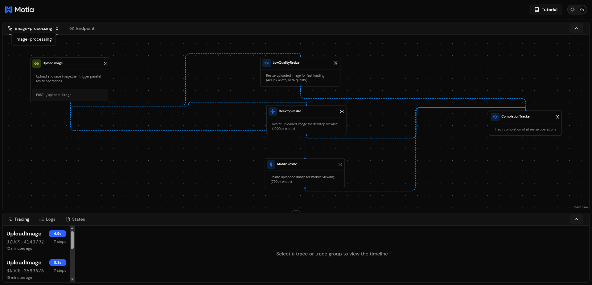
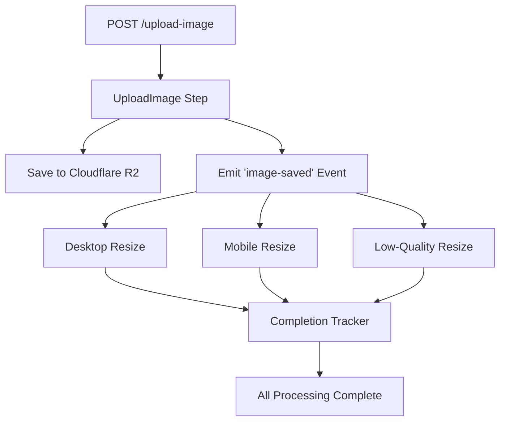

# ⚡ Lightning Fast Image Resizer with Motia & Cloudflare R2

A high-performance, event-driven image processing service built with **[Motia](https://motia.dev/)** - a powerful orchestration platform that combines API servers, background job processors, cron schedulers, and workflow orchestration engines into one unified system.



## 🎯 What This Does

This service automatically transforms uploaded images into multiple optimized formats for different use cases:

- **📱 Mobile Version**: 720px width, 85% quality - perfect for mobile devices
- **🖥️ Desktop Version**: 1920px width, 90% quality - high-quality for desktop displays
- **⚡ Low-Quality Version**: 480px width, 60% quality - fast-loading thumbnails/previews

All processing happens **in parallel** using Motia's event-driven architecture, providing lightning-fast results while maintaining reliability through built-in error handling and retry mechanisms.

## 🚀 Powered by Motia

### What is Motia?

Motia is a comprehensive orchestration platform that provides:

- **🔌 API Servers**: RESTful endpoints with automatic validation and documentation
- **⚙️ Background Job Processors**: Reliable task processing with retry mechanisms
- **⏰ Cron Schedulers**: Time-based job scheduling and automation
- **🔄 Workflow Orchestration**: Event-driven workflows with dependency management
- **📊 GUI Admin Interface**: Web-based dashboard for monitoring and management

### Admin GUI Features

The Motia Workbench provides a powerful web interface for:

- **📈 Real-time Monitoring**: Track all running processes, workflows, and API calls
- **🔍 Execution Logs**: Detailed logging with trace IDs for debugging
- **📋 Event Flow Visualization**: See how events flow through your system
- **⚡ Performance Metrics**: Monitor processing times, success rates, and throughput
- **🛠️ Workflow Management**: Start, stop, and configure workflows from the GUI
- **🔧 Configuration Management**: Update settings and environment variables
- **📊 Analytics Dashboard**: Historical data and performance insights

## 🏗️ Architecture Overview

This image resizer demonstrates Motia's powerful orchestration capabilities:



### 📋 Step Breakdown

| Step                        | Type          | Description                  | Triggers                    |
| --------------------------- | ------------- | ---------------------------- | --------------------------- |
| **UploadImage**       | API Route     | Receives & validates uploads | Manual API call             |
| **DesktopResize**     | Event Handler | Creates 1920px version       | `image-saved` event       |
| **MobileResize**      | Event Handler | Creates 720px version        | `image-saved` event       |
| **LowQualityResize**  | Event Handler | Creates 480px version        | `image-saved` event       |
| **CompletionTracker** | Event Handler | Tracks completion status     | `resize-completed` events |

## 🛠️ Setup & Installation

### 1. Prerequisites

```bash
npm install
```

### 2. Configure Cloudflare R2

Create a Cloudflare R2 bucket and get your credentials:

```bash
cp .env.example .env
```

Edit `.env` with your R2 details:

```env
STORAGE_TYPE=s3
AWS_ACCESS_KEY_ID=your_r2_access_key
AWS_SECRET_ACCESS_KEY=your_r2_secret_key  
AWS_REGION=auto
AWS_S3_BUCKET_NAME=your_bucket_name
R2_BUCKET_NAME=your_bucket_name
AWS_S3_ENDPOINT=https://your_account_id.r2.cloudflarestorage.com
AWS_S3_PUBLIC_URL=https://your_account_id.r2.cloudflarestorage.com
```

### 3. Start the Service

```bash
# Development with GUI
npm run dev

# The Motia Workbench GUI will be available at:
# http://localhost:3000/_workbench
```

## 🔌 API Usage

### Upload Image

**POST** `/upload-image`

```bash
curl -X POST http://localhost:3000/upload-image \
  -H "Content-Type: application/json" \
  -d '{
    "filename": "example.jpg",
    "data": "data:image/jpeg;base64,/9j/4AAQSkZJRgABAQEAAA..."
  }'
```

**Response:**

```json
{
  "message": "Image uploaded successfully and processing started",
  "traceId": "ABC123-456789",
  "imageMetadata": {
    "originalFilename": "example.jpg",
    "uniqueFilename": "example_uuid.jpg", 
    "format": "jpeg",
    "originalStorageKey": "originals/example_uuid.jpg",
    "originalUrl": "https://your-r2-url.com/originals/example_uuid.jpg",
    "uploadedAt": "2024-01-01T12:00:00.000Z"
  }
}
```

### Test with Sample Images

```bash
# Create a test image
node scripts/create-test-image.js

# Upload the test image
curl -X POST http://localhost:3000/upload-image \
  -H "Content-Type: application/json" \
  -d @test-small-payload.json
```

## 📊 Monitoring & Administration

### Motia Workbench GUI

Access the admin interface at `http://localhost:3000/_workbench` to:

- **Monitor Live Processing**: See real-time image resize operations
- **View Execution Traces**: Follow the complete workflow from upload to completion
- **Check Performance**: Monitor processing times and success rates
- **Debug Issues**: Access detailed logs and error information
- **Manage Workflows**: Start/stop processing flows as needed

### Key Metrics to Monitor

- **Upload Success Rate**: Percentage of successful image uploads
- **Average Processing Time**: Time from upload to completion
- **Parallel Efficiency**: How well the three resize operations perform in parallel
- **Storage Utilization**: R2 bucket usage and costs
- **Error Rates**: Failed operations and their causes

## 🏪 Storage Structure

Images are organized in Cloudflare R2 with the following structure:

your-bucket/
├── originals/
│   └── filename_uuid.ext          # Original uploaded images
├── desktop/
│   └── filename_uuid-desktop.ext  # 1920px desktop versions
├── mobile/
│   └── filename_uuid-mobile.ext   # 720px mobile versions
└── lowquality/
    └── filename_uuid-lowquality.ext # 480px preview versions

## 🎯 Key Benefits

### Why Motia?

- **🔄 Event-Driven**: Reliable, scalable workflow orchestration
- **📊 Built-in Monitoring**: GUI dashboard with real-time insights
- **🛡️ Error Handling**: Automatic retries and failure recovery
- **📈 Performance**: Parallel processing for maximum throughput
- **🔧 Developer Experience**: TypeScript support with full type safety
- **📱 Modern Stack**: Built for cloud-native, serverless deployments

### Why Cloudflare R2?

- **💰 Cost Effective**: Zero egress fees, competitive storage pricing
- **🌍 Global CDN**: Built-in worldwide distribution
- **⚡ High Performance**: Edge locations for fast image delivery
- **🔒 Secure**: Enterprise-grade security and compliance
- **🔌 S3 Compatible**: Drop-in replacement for AWS S3

## 🚨 Error Handling

The system handles various scenarios gracefully:

- **❌ Invalid Formats**: Only JPEG, PNG, WebP supported
- **📏 Size Limits**: 50MB maximum file size
- **🔄 Network Issues**: Automatic retry with exponential backoff
- **💾 Storage Failures**: Graceful degradation and error reporting
- **⏱️ Timeout Handling**: Configurable processing timeouts

All errors are logged with detailed context and trace IDs for easy debugging through the Motia Workbench GUI.

---

Built with ❤️ using [Motia](https://motia.dev/) - The unified orchestration platform for modern applications.
